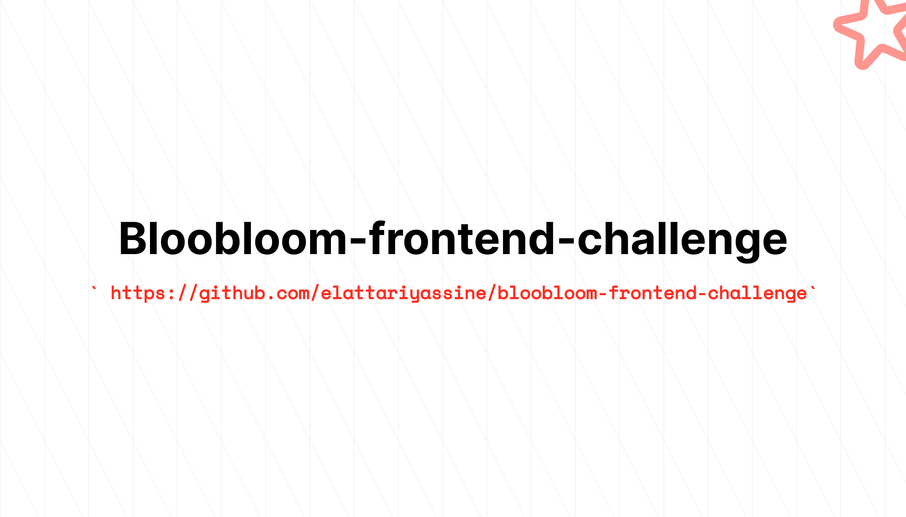

## Bloobloom frontend challenge

My implementation of Bloobloom frontend challenge.

## Implemented features

- [x] Glasses View (view lists all glasses for a given collection. It has an infinite scroll function
      with each chunk having 12 items.).
- [x] Color & shape filters (select multiple values per filter and select multiple filters
      simultaneously).
- [x] Menu Interface.
- [x] Responsive (80%).

## Missing features (Lack of time)

- [x] Mobile filter.
- [x] Gallery animation

## Used technologies & libraries

- Vite 4.x
- Vue 3.x
- Vue-router 4.x
- Pinia 2.x
- @heroicons/vue 2.x

## Project Setup

```sh
npm install
```

### Compile and Hot-Reload for Development

```sh
npm run dev
```

### Compile and Minify for Production

```sh
npm run build
```

### Lint with [ESLint](https://eslint.org/)

```sh
npm run lint
```
